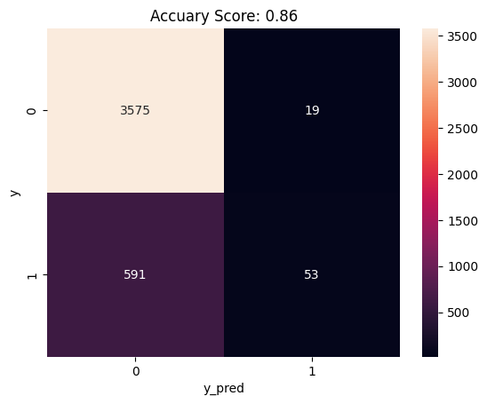
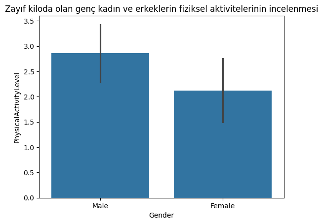
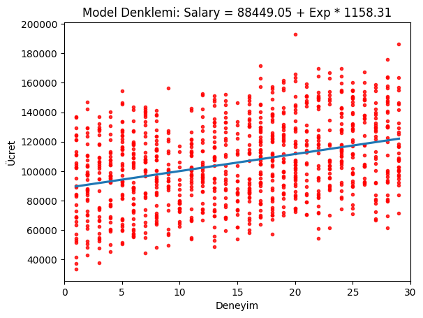
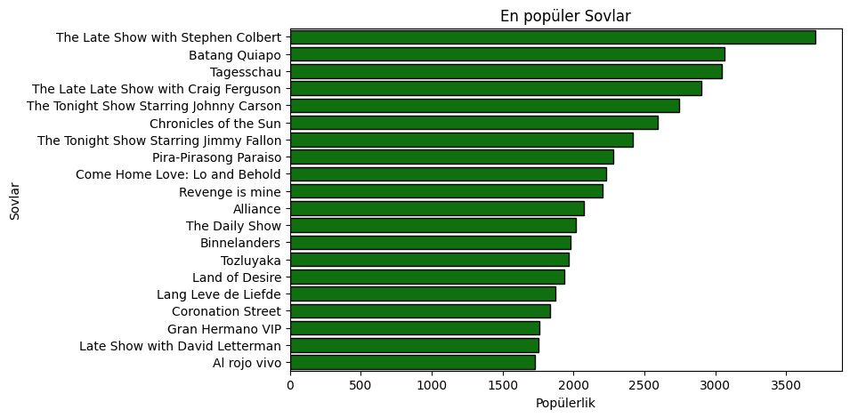

Öğrenmek ve kendimi geliştirmek için yaptığım 4 farklı mini EDA Projesi.

Çeşitli çıktıları aşağıya koydum.
**--**

**--**

**--**

**--**


Projenin çalıştırılması için:
```bash
git clone https://github.com/mustafaklee/EDA-Uygulamalari.git
cd EDA-Uygulamalari
```
